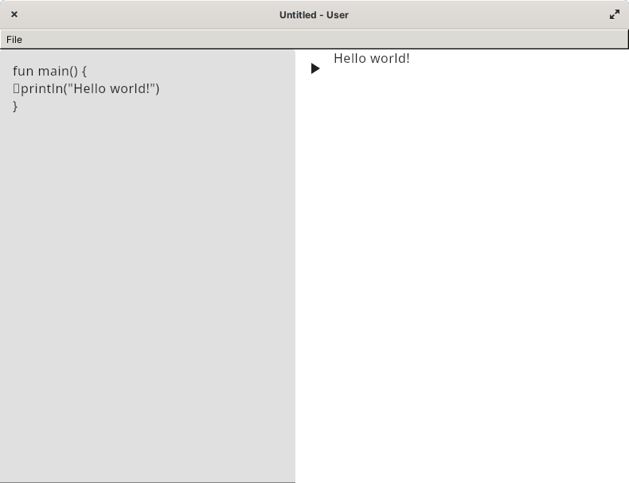

# KotlinPlayground
A desktop client of the oficial [Kotlin playground](https://play.kotlinlang.org) by JetBrains.

## Showcase

    

## Installation

Git clone the project then build it, or install the bundled binary from the [releases section](https://github.com/z0xyz/kotlinPlayground/releases) for your respective platform.

## Contributing

Pull requests are welcome. For major changes, please open an issue first
to discuss what you would like to change.

## Bash Equivlalent
You can use the [bash equivalent](./kotlinPlayground), but it's rather rudimentary.

## License

[Apache License](./LICENSE.txt)
